<p align=center>
   
</p>

<p align=center>
   SUPER速配-伙伴匹配系统
</p>
<p align="center">
<a target="_blank" href="https://gitee.com/ochiamaluo/super-backend">
		</img>
        </img>
        </img>
        </img>
		</img>
        </img>
        </img>
		</img>
		</img>
		</img>
		</img>
		</img>
</a></p>

## 项目介绍

校园伙伴匹配（CAMPUS 伙伴），一个前后端分离的用户匹配系统，前端使用 **Vite + Vue3 + Vant4** ，后端使用 **SpringBoot +
MyBatis-Plus + MySQL + Redis** 等技术，使用 **WebSocket** 实现实时通信，并结合 **阿里云SDK** 完成图片上传。本项目使用Apache
License Version 2.0开源协议。

#### 前端地址:

Gitee： https://gitee.com/kcsen/campus-partner-frontend.git

Github： https://github.com/kongshier/campus-partner-frontend.git

#### 后端地址:
Gitee：https://gitee.com/kcsen/campus-backend-master.git

GitHub：https://github.com/kongshier/campus-backend-master.git

## 在线体验

http://pt.kongshier.top

账号可以自行注册，一切聊天、评论需遵守中华人民共和国有关法律规定。

仅支持有效手机号注册，请使用以下账号直接登录：

账号：admin

密码：12345678

## 项目背景

许多热爱学习竞赛的校园同学在参加比赛时常常面临没有队友的问题，这使得他们很难发挥自己的实力，也很难取得好成绩。同时，许多用户在寻找队友时也面临一些困难，比如无法找到合适的人选，或者无法与潜在的队友进行充分的交流和沟通。因此，我们希望通过该网站，为这些用户提供一个交流平台，帮助他们找到理想的队友，组建强大的竞赛团队，参加各种校园比赛，并最终实现自己的梦想。

## 核心功能

1. 用户注册和登录：用户可以通过注册账号并登录使用该网站。
2. 标签匹配：用户可以选择自己的技能和需求标签，系统会根据标签匹配合适的队友。
3. 组队功能：用户可以与其他用户组建队伍，一起参加校园竞赛。
4. 帖文发布、点赞和关注：用户可以发布自己的帖文，其他用户可以对其进行点赞和关注，以便更好地了解和交流。
5. 实时聊天：队伍中的用户可以进行实时聊天，方便沟通和协作。
6. 用户管理：管理员可以对用户进行管理，包括审核用户信息和处理用户投诉等。

## 项目亮点 

1. 用户登录：使用 Redis 实现分布式 Session，解决集群间登录态同步问题；使用 token 储存用户信息并实现续签和超时自动退出。

2. 对于项目中复杂的集合处理（比如为队伍列表关联已加入队伍的用户），使用 Java 8 Stream API 和 Lambda 表达式来简化编码。

3. 使用 Redis 缓存首页高频访问的用户信息列表，将接口响应时长从 12520ms缩短至400ms。且通过自定义 Redis 序列化器来解决数据乱码、空间浪费的问题。

4. 为解决首次访问系统的用户主页加载过慢的问题，使用 quartz 定时任务来实现缓存预热，并通过分布式锁保证多机部署时定时任务不会重复执行。

5. 为解决同一用户重复加入队伍、入队人数超限的问题，使用 Redisson 分布式锁来实现操作互斥，保证了接口幂等性。

6. 使用编辑距离算法实现了根据标签匹配最相似用户的功能，并通过优先队列来减少 TOP N 运算过程中的内存占用。

7. 使用 Knife4j + Swagger 自动生成后端接口文档，并通过编写 ApiOperation 等注解补充接口注释，避免了人工编写维护文档的麻烦。

8. 使用阿里云对象存储用户头像、队伍图片

9. 用户可以每天签到一次

10. 使用 WebSocket 在单个TCP连接上进行全双工通信，创建持久性的连接，实现队伍聊天室中的实时聊天。

11. 前端使用 Vant4 UI 组件库，并封装了全局通用的 Layout 组件，使主页、搜索页、组队页布局一致、并减少重复代码。

12. 基于 Vue Router 全局路由守卫实现了根据不同页面来动态切换导航栏标题， 并通过在全局路由配置文件扩展 title 字段来减少无意义的 if else 代码。

13. 使用 component is 标签自定义少数页面的基本布局，优化用户体验。

14. 封装前端卡片组件，对数据做统一处理，减少重复代码。

15. 使用 defineEmits 为子组件绑定事件，并使用 emits 将事件发送给父组件，优化用户在操作后的体验。

## 技术选型

**前端**

- Vue 3

- Vite 脚手架

- Vant4 UI 移动端组件库

- Axios 请求库

**后端**

- JAVA SpringBoot 框架

- MySQL 数据库

- Mybatis-Plus

- Mybatis X 根据数据库表生成对应的mapper、service、model代码

- Redis 缓存

- Redisson 分布式锁

- Quartz定时任务

- Swagger + Knife4j 接口文档

- Gson JSON序列化库

- 最短编辑距离算法

- WebSocket

- 阿里云对象存储 OSS

### 软件架构
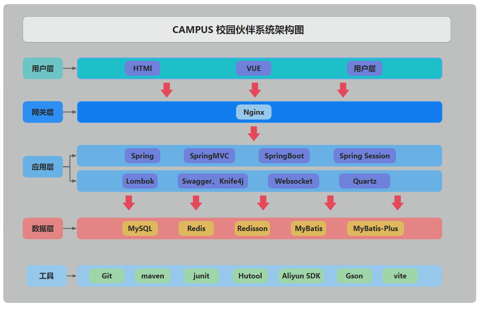

### 数据库架构

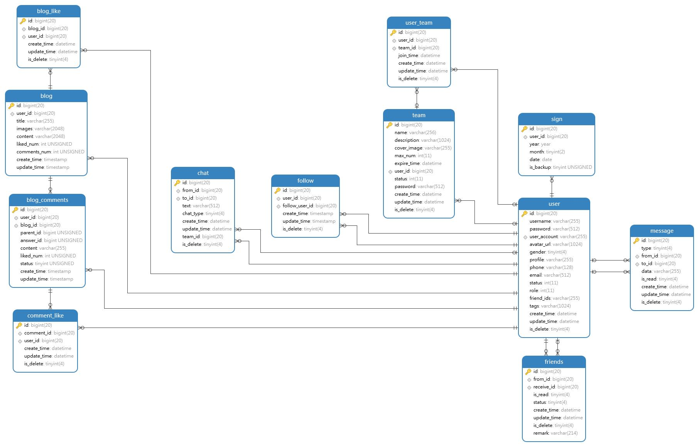

## 后端部署

1. 执行安装后端所需依赖

   ```bash
   maven install
   ```

2. 新建 campus 数据库，并执行 campus.sql
3. 运行SuperApplication

> (暂不支持)修改application.xml，其中spring.mail为非必填项，不填写则无法发送邮件
> (暂不支持)修改SMSUtils配置，若不修改则无法发送验证码短信，可通过控制台输出的方式获取生成的验证码。

## 功能介绍

### 模拟数据

首次启动可执行测试类中的方法生成一定数量的随机用户模拟数据。

### 主页

1）匹配用户：用户未登录时为随机查询，用户登录后若用户填写了标签，则将根据标签的相似度进行匹配。

2）热门帖文：展示用户发布的博文，按照时间顺序，新发布的帖文在前。

3）滚动分页查询：用户可上滑匹配用户或热门帖文，将不断查询下一页的数据，下拉超过一定高度后显示回到顶部按钮。

4）下拉刷新：用户可下拉匹配用户或热门帖文，将从第一页开始重新加载。

### 用户注册

1）用户未登录时点击个人页将跳转至登录页。

2）注册成功后将跳转至标签编辑页，用户可选择与自己匹配的标签，也可以自定义标签。若希望以后再填写，可以点击右上角跳过。

> 暂时支持（可以访问原作者作品：http://ochiamalu.xyz）
>1. 击发送验证码后显示验证码输入框，并进入60秒倒计时，在此期间不可再次发送验证码。**注意：用户名为登录所用。**
>2. 若配置正确将发送短信至手机号，若不进行配置可将验证码打印至控制台。

### 个人主页

1）注册成功后或登陆后可以进入个人页，用户可点击修改信息修改除登录账号外的信息。

2）创建的队伍：用户创建的队伍信息。

3）加入的队伍：用户加入的队伍信息。

4）我写的帖文：用户创建的帖文信息。

5）联系客服：用户遇到问题可联系客服。

### 忘记密码或账号

1）忘记密码：用户可点击登录页中的忘记密码进入。

2）输入注册时使用的手机号。

> (暂不支持) 此时将显示绑定的账号，若忘记密码可输入验证码
> (暂不支持) 验证通过后即可修改新密码

### 修改信息

1）头像修改：用户点击后可上传喜欢的头像。

2）昵称修改：用户可修改展示的昵称。

3）标签修改：用户可以更新自己的标签。

4）个性签名：用户可以简略地描述自己。

5）性别修改：用户可修改性别。

6）电话修改：用户修改为新手机号。
> (暂不支持)若配置正确，将发送验证码至手机，验证通过后将更新手机号。

7）邮箱修改：用户修改新邮箱账号。
> (暂不支持)若配置正确，将发送验证码至邮箱，验证通过后将更新邮箱。

### 搜索用户

1）标签搜索：用户可以点击右上角的搜索按钮，通过标签搜索用户。

### 用户详情

1）用户详情：用户点击任意其他用户后可跳转至用户详情页。

### 创建队伍

1）点击队伍页右下角的加号可以跳转至创建队伍页面。

2）若不填写过期时间则队伍永久有效。

3）公开状态所有人可加入，私有状态仅自己可见，加密状态其他用户输入正确的密码则可以加入。

### 队伍详情

1）在队伍页可以看到非私有队伍，队长和管理员可以更新队伍和解散队伍。加入加密队伍需要输入密码。

2）搜索队伍：输入队伍名可搜索队伍。

3）队伍详情：点击队伍后可进入队伍详情页，可以看到队伍加入的队员，队长或管理员可以修改队伍封面图片。

4）队伍聊天室：队员可以进入队伍聊天室，进行实时聊天。

### 博文

1）用户可以点击导航栏的加号新建博文。

2）新博文将显示在热门帖文中。

3）点击博文将进入博文详情页。

4）用户可以关注其他用户。

5）更多操作：点击右上角可显示弹框。复制链接可将博文链接复制。

编辑可以编辑当前博文，删除可以删除当前博文，举报可以举报当博文。

只有博文作者或管理员可以编辑、删除博文。

6）点赞博文：用户可以点击右下角点赞博文。

### 评论

1）博文评论：用户可以在博文下评论。

2）点赞评论：用户可以点赞评论。

3）删除评论：评论作者和管理员可以删除评论。

### 消息中心

1）新消息提醒：用户收到新消息时将提醒用户。

2）我的关注：用户关注的其他用户在更新博文后将把消息推送给所有粉丝，并在粉丝的我的关注中显示。

3）聊天室列表：这里将展示公共聊天室和已加入的队伍聊天室。

4）所有评论：展示用户所有的评论。可以进行点赞和删除。

5）赞：当用户收到点赞后将在这里显示。

6）关注：展示用户关注的其他用户。

7）粉丝：展示用户的粉丝。

### 好友模块
1）申请好友：可以发送好友申请。

2）申请列表：展示所有申请好友的用户

3）同意添加好友

4）拒绝添加好友


### 签到
1）签到：用户每天签到一次


## 部分界面展示

**登录界面**

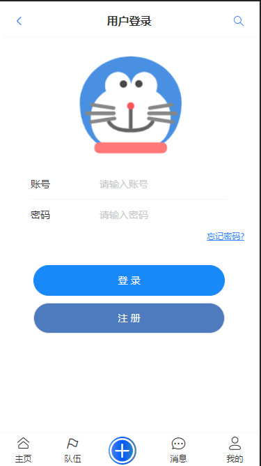

**首页**

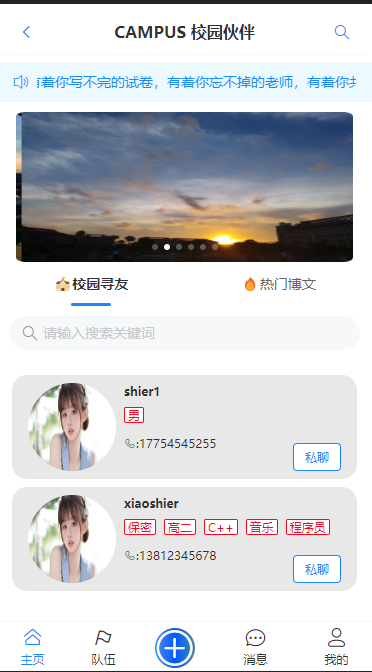

**博文界面**

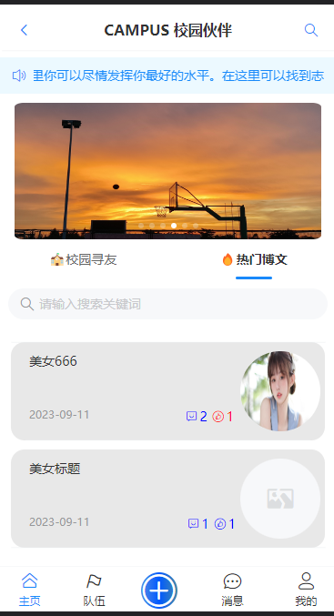


**队伍界面**

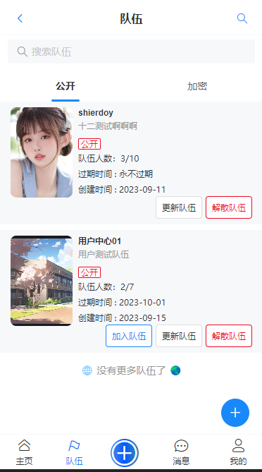

**发布博文界面**

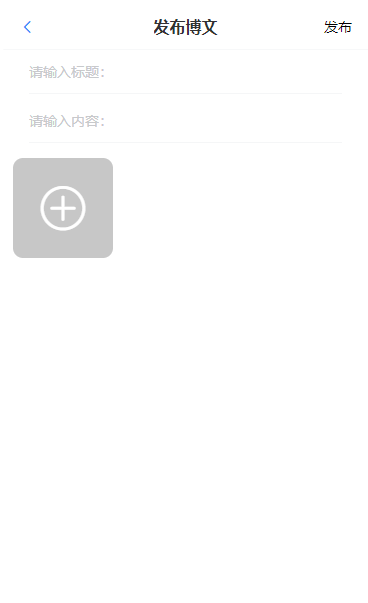

**消息中心界面**

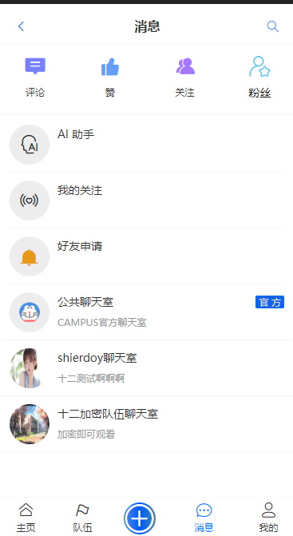

**我的界面**

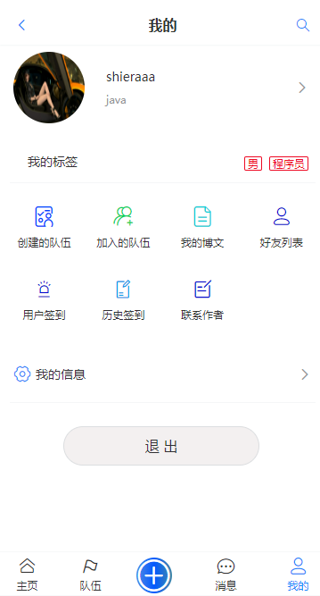

**个人信息界面**

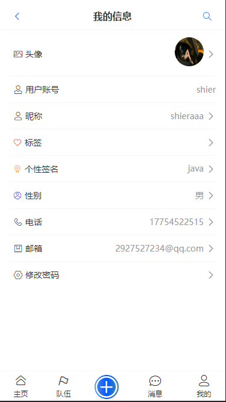

**根据标签搜索界面**

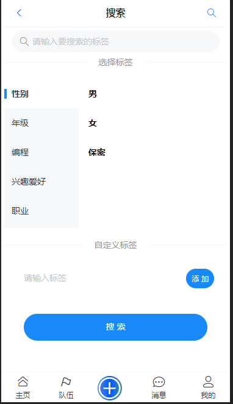
